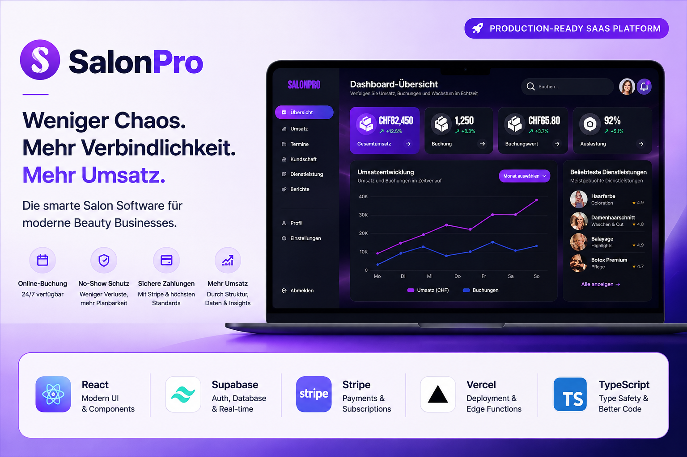

# 💜 SalonPro

  

  

> **Production-ready SaaS platform for beauty salons, barbershops and beauty studios.**

SalonPro is a modern SaaS application designed to help beauty businesses manage appointments, online bookings, payments and customer communication through a responsive and intuitive platform.

---

👉 **Live Application:** https://salonpro-web.vercel.app

## 📌 Project Overview

SalonPro was designed and developed from concept to production.

The platform includes:

- Online appointment booking
- Customer management
- Responsive calendar
- Stripe payments
- Automated email notifications
- Appointment rescheduling and cancellation
- Multi-tenant architecture
- Supabase authentication
- Mobile-first responsive design

---

## 🛠️ Technology Stack

- HTML5
- CSS3
- JavaScript
- Supabase
- PostgreSQL
- Stripe
- Resend
- Vercel
- GitHub

---

**More project documentation, architecture diagrams and screenshots will be added in the next updates.**
